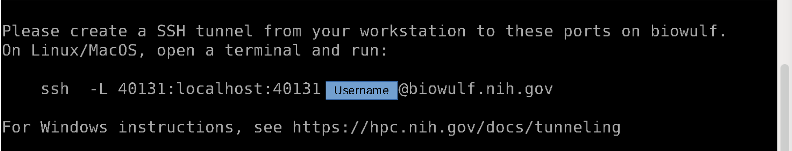
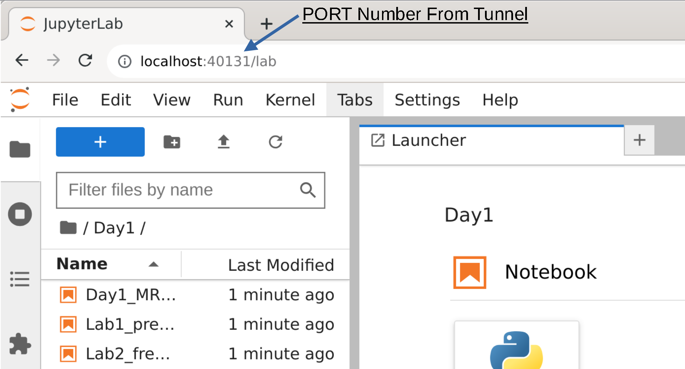

# MEG_workshop_2023  << UNDER CONSTRUCTION >>

## Day 1 (09/27/2023)
| Time  | Topic | Presenter |
| :---- | ---- | ---- |
| 9:00 - 9:15 | Bagel Config + Coffee Download + Computer Setup |
| 9:15 - 9:30 | Course Intro + MEGcore Intro | MEGcore |
| 9:30 - 10:30 | Intro to MEG and general overview of source localization | Fred |
| 10:30 - 11:00 | MEG Hardware and Signal Generation / Collection | Stephen | 
| 11:00 - 11:15 | Break
| 11:15 - 12:15 | Stimuli, trigger processing, epochs, evoked data, bad chans | Tom + Anna |
|  |  bad epochs, filtering, abberant signals | 
| 12:15 - 1:30 | Code (Lab1) + Lunch | 
| 1:30 - 2:30 | Filtering Data, Frequency Analysis, Hilbert, Brain Rythms, and Artifacts | Allison | 
| 2:30 - 3:00 | Code |
| 3:00 - 4:00 | MRI Processing, placing fiducials, coreg, source model (volume + surface) | Anna + Jeff |
| | BEM, Forward Model | 
| 4:00 - 4:30 | Code (MRI Processing / Prep) |

## Day 2 (10/04/2023)
| Time  | Topic | Presenter |
| :---- | ---- | ---- |
| 9:30-10:30 | Source Localization (Dipoles, multiple dipoles, MNE, dSPM, Beamformer) | Fred + Jeff | 
| 10:30 - 11:30 | [Lab 4](https://github.com/nih-megcore/MEG_workshop_2023/blob/main/Day2/Lab4_SourceLocalization.ipynb) | 
| 11:30 - 12:00 | Beamformer Specifics - Covariance, filtering, data rank, regularization | Allison |
| 12:00 - 1:00| Lunch |
| 1:00 - 2:00 | Single subject to group data | Jeff |
| 2:00 - 2:30 | Code |
| 2:30 - 3:30 | Statistics (parametric / log transform / resampling stats / clusters ) | Fred + Allison |
| 3:30 - 4:00 | Code | 
| 4:00 - 4:20 | Course Review | Allison |
| 4:20 - 5:00 | Additional Techniques: OPMs,  Connectivity | Amaia + Lucrezia |
| | Additional Techniques: Decoding, Dynamic Causal Modeling | Shruti + Jess |

# Biowulf users (must be NIH associated)
Log into biowulf:  `ssh -Y USERNAME@biowulf.nih.gov`
```
#Allocate resources for processing
sinteractive --mem=16G --cpus-per-task=12 --gres=lscratch:10 --tunnel --time=08:00:00
```
You will see a line like the below. Follow the instructions (start a new terminal into biowulf), then return to original terminal for the rest of the commands.


Copy notebooks to your local folder.  Change directories first if you don't want the code/data in your home folder.
```
module use --append /data/MEGmodules/modulefiles  #You can add this to your .bashrc for convenience
module load meg_workshop

get_code   #Copy the code to your current directory
get_data   #Copy and untar the data to your /data/${USER}/meg_data_workshop

cd MEG_workshop_2023 
./notebook_start.sh  #Start the notebook server on biowulf
```
Enter this into the address bar of your web browser `localhost:<PORT>` <br>



# Install (not required for biowulf users)
The following software is required to run all parts of the coding sections: afni + freesurfer + git + miniconda(/conda) <br>
To run the majority of the code: miniconda/conda + git are required <br><br>

Mamba is not required, but will install faster than conda (functionally they are the same) <br>
To install mamba - `conda install --channel=conda-forge --name=base mamba`
<br><br>
### Install (version1) - requires make, mamba, git
```
git clone https://github.com/nih-megcore/MEG_workshop_2023.git
cd MEG_workshop_2023
make install 
```

### Install (version2) 
```
#Clone this repository
git clone https://github.com/nih-megcore/MEG_workshop_2023.git

#Install MNE
mamba create --override-channels --channel=conda-forge --name=MEG_workshop mne pip jupyterlab -y
conda activate MEG_workshop
pip install h5io pymatreader

#Install the Workshop files
cd MEG_workshop_2023
pip install -e .    #Install this code
pip install git+https://github.com/nih-megcore/nih_to_mne.git  #Install some auxilliary NIH code
```

## Install dataset
```
mamba create -n datalad -c conda-forge datalad gdown -y
conda activate datalad
```
This will pull the NIMH_hv OpenNeuro repository and associated files. <br>
This will download the freesurfer processed MRI files as well
```
 ./extras/datalad_pull.sh
```

## Install auxiliary code
Install freesurfer: https://surfer.nmr.mgh.harvard.edu/fswiki/rel7downloads <br>
Install Afni: https://afni.nimh.nih.gov/pub/dist/doc/htmldoc/background_install/main_toc.html <br>


## Check installs
Run `./check_requirements.sh` to check for freesurfer / afni / mne / jupyter installation.

# Data Format for code
Input data is in BIDS format from the NIH HV protocol. <br>
Data should be located in `/data/${USER}/meg_workshop_data` <br>
&nbsp;&nbsp; This will automatically be performed on biowulf with the `get_data` command. <br>
Derivatives data will be in `/data/${USER}/meg_workshop_data/{Day1,Day2}/${bids_id}/ses-01/meg/` <br>
&nbsp;&nbsp; Day2 derivatives will have pre-calculated bem, fwd, trans, src files <br>
